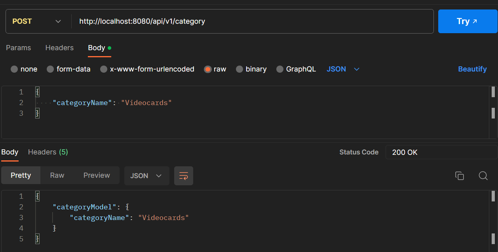
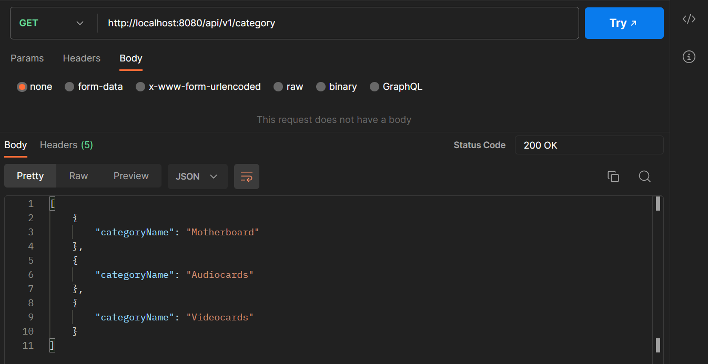
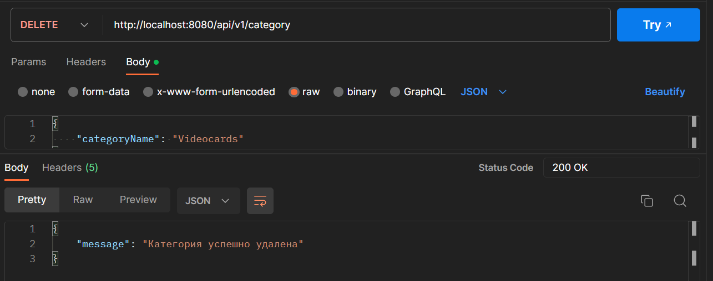
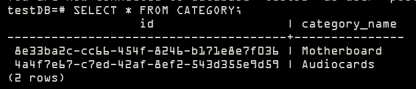
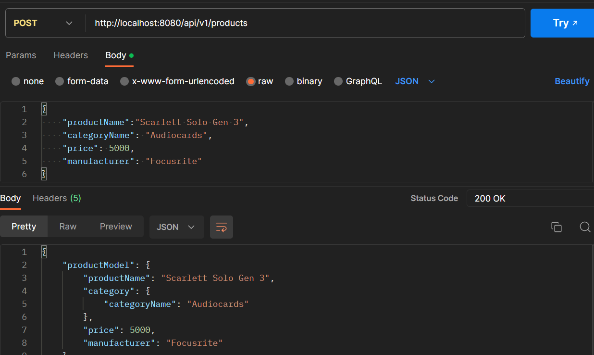
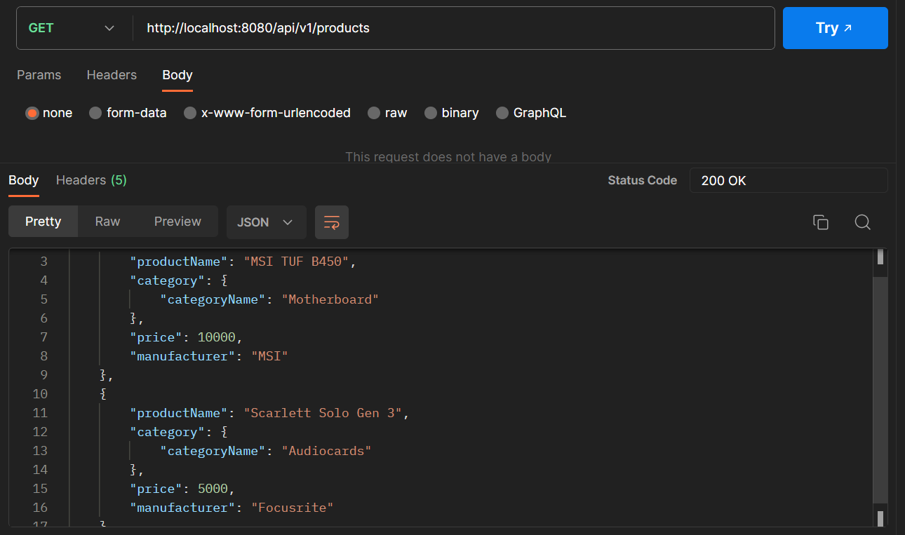
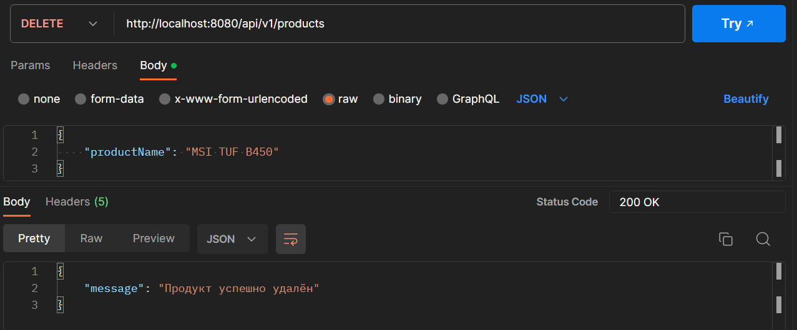
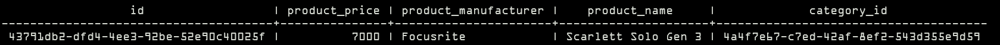
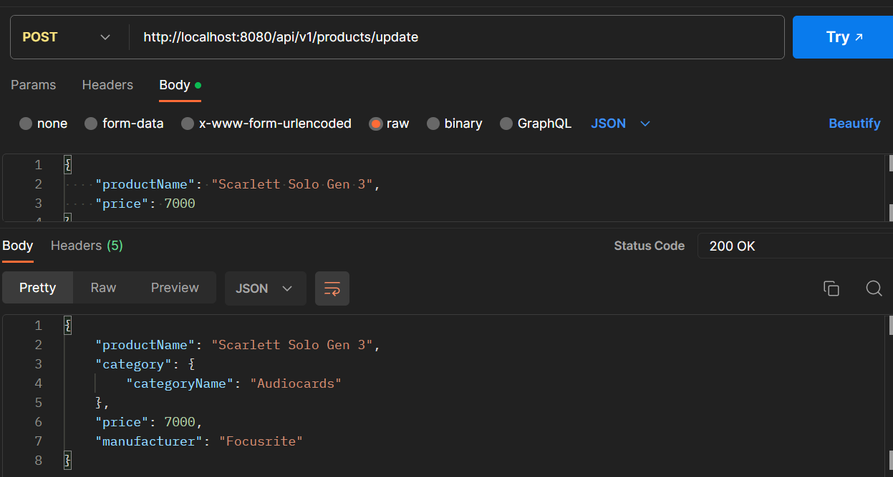

# Тестовое задания для Сбер.IT
## Инструкция
Перед запуском приложения перейдите в директорию проекта,
чтобы поднять контейнер с **PostgreSQL**. 

Для этого выполните команду ``docker-compose up -d``. После будет поднят контейнер с пустой базой данных.

Чтобы наполнить базу данных, запустите приложение и вызовите **API** метод на добавление новых картежей.

Чтобы смотреть базу данных после изменений, можете вызывать методы **API** для получения списков товаров и категорий.
Либо воспользуйтесь командой
`docker exec -it container_name psql -U postgres -W`, чтобы подключиться к базе данных.

## Функциональные тесты (ручные)
Тесты функционала проводились ручным методом с помощью **Postman**

### Добавление категории

### Список всех категорий

### Удаление категории

В базе данных более нет такой категории

### Добавление товара

### Список всех товаров

### Удаление товара

В базе данных более нет такого товара

### Обновление цены товара
